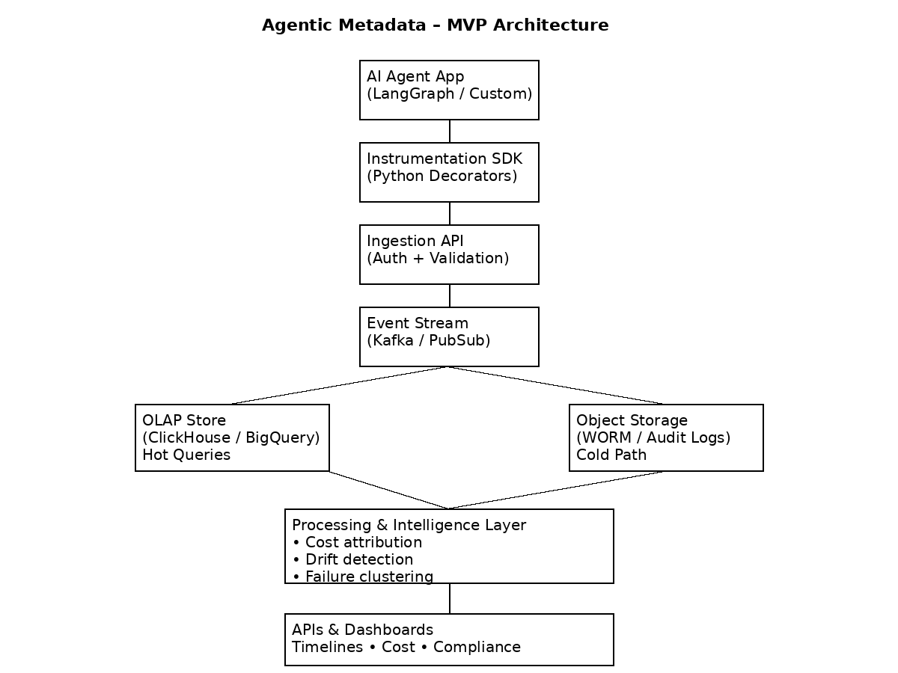

# agentic_metadata
Instrument AI agents → collect execution metadata → store immutably → analyze cost, drift, and failures → expose dashboards &amp; APIs.

## Table of Contents

# Agentic Metadata

Observability & intelligence for AI agents.

## What This Is
A metadata platform for tracing, auditing, and optimizing AI agent execution.

## Why It Exists
LLM agents fail silently, drift over time, and burn money invisibly.

We make agent behavior:
- Observable
- Auditable
- Optimizable

## Architecture


## MVP Features
- Python SDK decorators
- Metadata ingestion API
- Event streaming
- OLAP analytics
- Cost attribution
- Failure clustering (WIP)

## Tech Stack
- Python
- FastAPI
- ClickHouse
- Kafka (optional)
- Streamlit

## Getting Started
```bash
pip install -r requirements.txt
uvicorn ingestion.main:app
